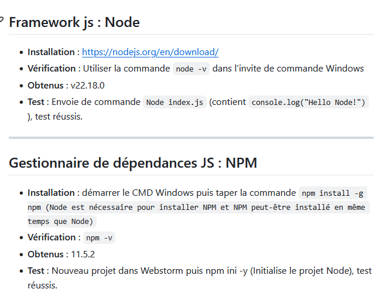
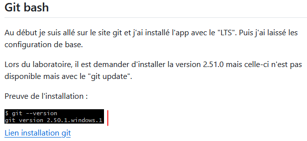
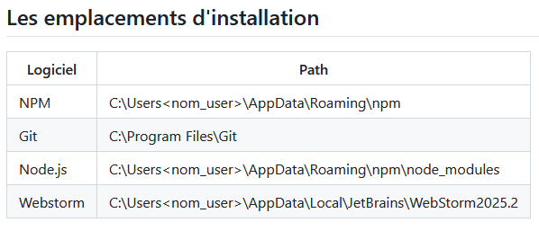
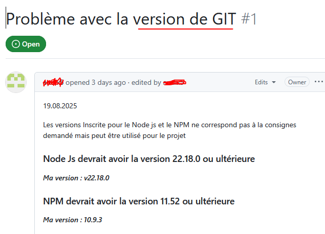

# Feedback

[← Retour au chapitre principal](README.md) · [⌂ Menu principal](../../README.md)

---

## Les sources

La "quasi" totalité des informations présentes dans votre document provient de sources externes. Il est essentiel de les mentionner pour appuyer vos dires et ne pas vous approprier du contenu d'un autre développeur.

*Exemple de paragraphe sourcé, et non sourcé.*

***

## Réutilisabilité de la documentation

Une capture d'écran est la bonne option pour démontrer le résultat d'une interface graphique ou tout autre élément qui ne peut pas être démontré à l'aide de ligne de commande ou de code.

> **Attention**
>
> Pour le reste tout doit être du code, du texte réutilisable par "copy/paste".

*Exemple de mention de commande, malheureusement il s'agit d'une capture d'écran. Imposslbe de la réutiliser.*

[Guide GitHub sur les blocs de code](https://docs.github.com/en/get-started/writing-on-github/working-with-advanced-formatting/creating-and-highlighting-code-blocks)

***

## Informations "privées"

Des informations tels que les chemins d'installations contenant votre nom, tout comme des particuliarités qui ne sont d'aucunes utilités pour d'autre développeurs doivent être retirées de la documentation.

Pour des raisons de confidentialités tout comme pour éviter de contraindre un collègue à des pratiques personnelles qui ne sont en rien de pré-requis au projet.

*Exemple d'anonymisation de chemin locaux. Mais pourquoi pas simplement les retirer ! D'autant plus que cela impose un système d'exploitation spécifique.*

***

## Issue "voie sans issue"

. Il ne s'agit bien d'une carte "joker" justiifant le fait de ne pas avoir pu réaliser le projet.

> **Attention**
>
> Soignez vos issues !

Une issue de qualité :

* permet de valoriser votre travail de recherche, même si cela n'a pas encore abouti à la solution souhaitée.
* évite de devoir recommencer le travail d'analyse à zéro.
* informe vos collègues des pannes, fonctionnalités non terminées sur le projet.

Ecrire une issue prend du temps. Il ne s'agit pas d'une "poubelle" à problème non résolu, mais bien d'un futur backlog.

*Exemple d'issue à peu de valeur ajoutée. Le titre n'est pas en lien avec le contenu de l'issue. Les propos sont difficilement compréhensible. Aucune source.*

Voici un échange entre développeur sur la pertinence d'écrire soigneusement une issue. Inspirez-vous en !

[Discussion GitHub sur la rédaction des issues](https://github.com/orgs/community/discussions/147722)

---

[← Retour au chapitre principal](README.md) · [⌂ Menu principal](../../README.md)
