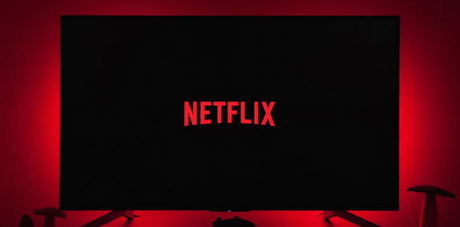
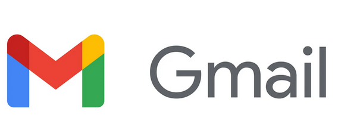
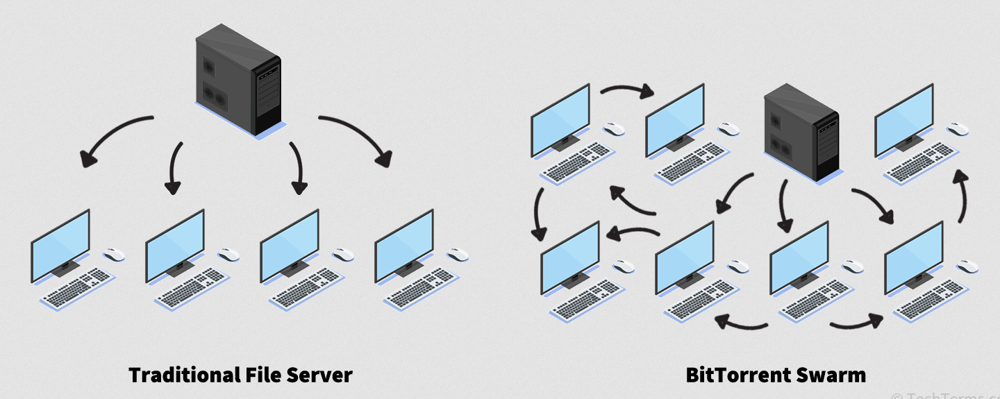

# Les différentes architectures

## Architecture monolithique

* **Description** : L’application est développée et déployée comme un seul bloc. Toute la logique métier, l’interface utilisateur et l’accès aux données sont regroupés dans un même codebase et un même processus.
* **Avantages** : Simplicité initiale, déploiement facile, moins de complexité au début.
* **Inconvénients** : Difficile à maintenir et à faire évoluer à grande échelle, tout déploiement nécessite de redéployer l’ensemble.

Exemple:

* **WordPress** (version classique auto-hébergée).
* **Pourquoi** : Le cœur, les extensions et l’interface sont déployés en un seul bloc PHP/MySQL ; toute mise à jour touche l’ensemble.

## Architecture microservices

* **Description** : L’application est découpée en plusieurs petits services indépendants, chacun responsable d’une fonction précise, communiquant souvent via des API REST ou gRPC.
* **Avantages** : Évolutivité, résilience, déploiement indépendant des services, possibilité d’utiliser différents langages et technologies.
* **Inconvénients** : Complexité accrue de gestion (orchestration, réseau, monitoring), besoin d’outils spécifiques (ex. Kubernetes).

Exemple:

* **Netflix**.
* **Pourquoi** : Chaque fonctionnalité (catalogue, recommandations, lecture vidéo, facturation…) est un microservice indépendant, souvent déployé dans le cloud, orchestré par Kubernetes.

## Architecture client-serveur

* **Description** : Séparation entre un **client** (interface utilisateur) et un **serveur** (traitement, données). Le client envoie des requêtes au serveur, qui renvoie des réponses.
* **Avantages** : Structure claire, centralisation des données et de la logique métier.
* **Inconvénients** : Le serveur est un point unique de défaillance et peut devenir un goulot d’étranglement.

Exemple:

* **Gmail (version web)**.
* **Pourquoi** : Le navigateur (client) envoie des requêtes au serveur Google, qui traite, stocke et renvoie les emails.

## Architecture peer-to-peer

* **Description** : Chaque nœud (poste utilisateur) agit à la fois comme client et serveur, échangeant directement des données sans serveur central.
* **Avantages** : Pas de point unique de défaillance, bonne résilience, adapté aux échanges massifs de données (ex. torrents).
* **Inconvénients** : Gestion complexe de la sécurité et de la cohérence, dépendance à la disponibilité et à la qualité de connexion des pairs.

Exemple:

* **BitTorrent**.
* **Pourquoi** : Chaque utilisateur est à la fois client et serveur, partageant directement les morceaux de fichiers avec les autres pairs sans serveur central unique.

### Sources images:

* [https://www.facebook.com/WordPresscom/](https://www.facebook.com/WordPresscom/)
* [https://techterms.com/definition/bittorrent](https://techterms.com/definition/bittorrent)
* [https://www.strategyzer.com/library/netflix-is-winding-down-its-dvd-by-mail-service-for-good](https://www.strategyzer.com/library/netflix-is-winding-down-its-dvd-by-mail-service-for-good)
* [https://features.getmailbird.com/read-receipts/gmail-com](https://features.getmailbird.com/read-receipts/gmail-com)
* [https://aws.amazon.com/compare/the-difference-between-monolithic-and-microservices-architecture/](https://aws.amazon.com/compare/the-difference-between-monolithic-and-microservices-architecture/)
